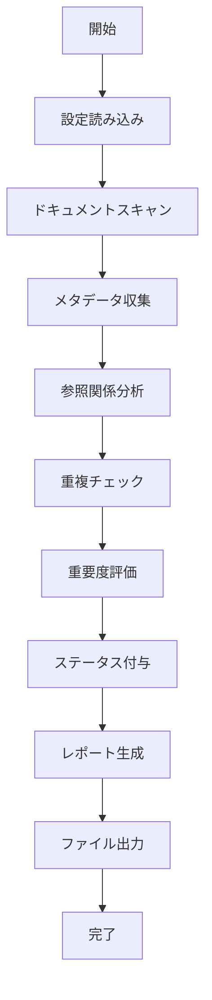

# Design Document: Document Organization System

## Overview

このドキュメント整理管理システムは、Kiro Skillとして実装される再利用可能なツールです。ワークスペース内のドキュメントファイルをスキャンし、メタデータを収集し、参照関係を分析し、重要度を評価して、整理結果をマークダウンレポートとして出力します。

### 主要な設計目標

1. **再利用性**: 任意のワークスペースで実行可能なKiro Skillとして実装
2. **自動化**: Workflowとして実行可能で、手動介入を最小限に
3. **拡張性**: 新しい評価基準やカテゴリを簡単に追加可能
4. **安全性**: 実際の削除は行わず、推奨のみを提供
5. **透明性**: すべての判断理由を明確に記録

## Architecture

### システム構成

```
document-organization-system/
├── SKILL.md                    # Kiro Skill定義
├── workflow.md                 # Workflow定義
├── src/
│   ├── scanner.ts             # ドキュメントスキャナー
│   ├── metadata.ts            # メタデータ収集
│   ├── analyzer.ts            # 参照関係分析
│   ├── evaluator.ts           # 重要度評価
│   ├── reporter.ts            # レポート生成
│   ├── config.ts              # 設定管理
│   └── types.ts               # 型定義
├── tests/
│   ├── scanner.test.ts
│   ├── metadata.test.ts
│   ├── analyzer.test.ts
│   ├── evaluator.test.ts
│   └── reporter.test.ts
└── config.json                 # デフォルト設定
```

### 実行フロー



## Components and Interfaces

### 1. Scanner (scanner.ts)

**責任**: ワークスペース内のドキュメントファイルを再帰的にスキャン

```typescript
interface ScannerConfig {
  includePaths: string[];        // スキャン対象パス
  excludePaths: string[];        // 除外パス
  fileExtensions: string[];      // 対象拡張子
}

interface ScannedDocument {
  path: string;                  // ファイルパス（相対）
  absolutePath: string;          // 絶対パス
}

class Scanner {
  constructor(config: ScannerConfig);
  
  // ドキュメントをスキャン
  scan(workspacePath: string): Promise<ScannedDocument[]>;
  
  // パスが除外対象かチェック
  private isExcluded(path: string): boolean;
  
  // ファイル拡張子が対象かチェック
  private isValidExtension(path: string): boolean;
}
```

### 2. Metadata Collector (metadata.ts)

**責任**: 各ドキュメントのメタデータを収集

```typescript
interface DocumentMetadata {
  path: string;
  createdAt: Date;
  modifiedAt: Date;
  sizeBytes: number;
  lineCount: number;
  category: DocumentCategory;
}

enum DocumentCategory {
  SPEC = 'spec',
  WORKFLOW = 'workflow',
  SKILL = 'skill',
  BACKLOG = 'backlog',
  DOCS = 'docs',
  CONFIG = 'config',
  OTHER = 'other'
}

class MetadataCollector {
  // メタデータを収集
  collect(document: ScannedDocument): Promise<DocumentMetadata>;
  
  // カテゴリを判定
  private determineCategory(path: string): DocumentCategory;
  
  // 行数をカウント
  private countLines(content: string): number;
}
```

### 3. Reference Analyzer (analyzer.ts)

**責任**: ドキュメント間の参照関係を分析

```typescript
interface DocumentReference {
  sourcePath: string;
  targetPath: string;
  referenceType: ReferenceType;
}

enum ReferenceType {
  MARKDOWN_LINK = 'markdown_link',
  FILE_PATH = 'file_path',
  IMPORT = 'import'
}

interface ReferenceGraph {
  documents: Map<string, DocumentNode>;
  references: DocumentReference[];
}

interface DocumentNode {
  path: string;
  incomingRefs: number;
  outgoingRefs: number;
  referencedBy: string[];
  references: string[];
}

class ReferenceAnalyzer {
  // 参照関係を分析
  analyze(documents: DocumentMetadata[]): Promise<ReferenceGraph>;
  
  // ドキュメント内の参照を抽出
  private extractReferences(content: string, sourcePath: string): DocumentReference[];
  
  // マークダウンリンクを抽出
  private extractMarkdownLinks(content: string): string[];
  
  // ファイルパス参照を抽出
  private extractFilePaths(content: string): string[];
  
  // 参照グラフを構築
  private buildGraph(references: DocumentReference[]): ReferenceGraph;
}
```

### 4. Duplicate Checker (evaluator.ts内)

**責任**: 重複または類似ドキュメントを検出

```typescript
interface DuplicateInfo {
  path: string;
  duplicateOf: string | null;
  similarTo: string[];
  contentHash: string;
  similarity: number;
}

class DuplicateChecker {
  // 重複をチェック
  checkDuplicates(documents: DocumentMetadata[]): Promise<Map<string, DuplicateInfo>>;
  
  // コンテンツハッシュを計算
  private calculateHash(content: string): string;
  
  // 類似度を計算
  private calculateSimilarity(doc1: DocumentMetadata, doc2: DocumentMetadata): number;
}
```

### 5. Importance Evaluator (evaluator.ts)

**責任**: ドキュメントの重要度を評価

```typescript
interface ImportanceScore {
  path: string;
  score: number;              // 0-100
  factors: ScoreFactor[];
  reasoning: string;
}

interface ScoreFactor {
  name: string;
  weight: number;
  value: number;
  contribution: number;
}

enum ImportanceFactors {
  REFERENCE_COUNT = 'reference_count',      // 参照数
  RECENCY = 'recency',                      // 最終更新日
  SIZE = 'size',                            // ファイルサイズ
  CATEGORY = 'category',                    // カテゴリ
  DUPLICATE = 'duplicate'                   // 重複状態
}

class ImportanceEvaluator {
  // 重要度を評価
  evaluate(
    metadata: DocumentMetadata,
    refNode: DocumentNode,
    duplicateInfo: DuplicateInfo
  ): ImportanceScore;
  
  // 参照数スコアを計算
  private calculateReferenceScore(incomingRefs: number): number;
  
  // 最新性スコアを計算
  private calculateRecencyScore(modifiedAt: Date): number;
  
  // カテゴリスコアを計算
  private calculateCategoryScore(category: DocumentCategory): number;
  
  // 重複ペナルティを計算
  private calculateDuplicatePenalty(duplicateInfo: DuplicateInfo): number;
  
  // 総合スコアを計算
  private calculateTotalScore(factors: ScoreFactor[]): number;
  
  // 判断理由を生成
  private generateReasoning(factors: ScoreFactor[]): string;
}
```

### 6. Status Assigner (evaluator.ts内)

**責任**: ドキュメントにステータスを付与

```typescript
enum DocumentStatus {
  NECESSARY = '必要',
  UNNECESSARY = '不要',
  NEEDS_REVIEW = '要確認'
}

interface DocumentWithStatus {
  metadata: DocumentMetadata;
  importance: ImportanceScore;
  status: DocumentStatus;
  recommendation: string;
}

class StatusAssigner {
  // ステータスを付与
  assignStatus(importance: ImportanceScore, duplicateInfo: DuplicateInfo): DocumentStatus;
  
  // 推奨アクションを生成
  generateRecommendation(status: DocumentStatus, importance: ImportanceScore): string;
}
```

### 7. Report Generator (reporter.ts)

**責任**: 整理結果をマークダウンレポートとして生成

```typescript
interface OrganizationReport {
  generatedAt: Date;
  workspacePath: string;
  summary: ReportSummary;
  documentsByStatus: Map<DocumentStatus, DocumentWithStatus[]>;
  errors: ErrorInfo[];
}

interface ReportSummary {
  totalDocuments: number;
  necessaryCount: number;
  unnecessaryCount: number;
  needsReviewCount: number;
  duplicatesFound: number;
  totalSizeBytes: number;
}

interface ErrorInfo {
  path: string;
  error: string;
  timestamp: Date;
}

class ReportGenerator {
  // レポートを生成
  generate(
    documents: DocumentWithStatus[],
    errors: ErrorInfo[]
  ): OrganizationReport;
  
  // マークダウン形式で出力
  toMarkdown(report: OrganizationReport): string;
  
  // サマリーセクションを生成
  private generateSummary(report: OrganizationReport): string;
  
  // ステータス別セクションを生成
  private generateStatusSection(
    status: DocumentStatus,
    documents: DocumentWithStatus[]
  ): string;
  
  // 削除推奨セクションを生成
  private generateDeletionRecommendations(
    unnecessaryDocs: DocumentWithStatus[]
  ): string;
  
  // エラーセクションを生成
  private generateErrorSection(errors: ErrorInfo[]): string;
}
```

### 8. Configuration Manager (config.ts)

**責任**: 設定の読み込みと管理

```typescript
interface SystemConfig {
  scanner: ScannerConfig;
  evaluator: EvaluatorConfig;
  output: OutputConfig;
}

interface EvaluatorConfig {
  weights: {
    referenceCount: number;
    recency: number;
    size: number;
    category: number;
  };
  thresholds: {
    necessary: number;      // この値以上は必要
    unnecessary: number;    // この値以下は不要
  };
}

interface OutputConfig {
  outputPath: string;
  includeMetadata: boolean;
  includeReasoningDetails: boolean;
}

class ConfigManager {
  // 設定を読み込み
  static load(configPath?: string): SystemConfig;
  
  // デフォルト設定を取得
  static getDefaults(): SystemConfig;
  
  // 設定を検証
  private static validate(config: SystemConfig): boolean;
}
```

## Data Models

### Core Data Flow

```typescript
// 1. スキャン結果
ScannedDocument[] 
  ↓
// 2. メタデータ付きドキュメント
DocumentMetadata[]
  ↓
// 3. 参照グラフ + 重複情報
{ metadata: DocumentMetadata[], graph: ReferenceGraph, duplicates: Map<string, DuplicateInfo> }
  ↓
// 4. 重要度スコア付きドキュメント
{ metadata: DocumentMetadata, importance: ImportanceScore, duplicateInfo: DuplicateInfo }[]
  ↓
// 5. ステータス付きドキュメント
DocumentWithStatus[]
  ↓
// 6. 最終レポート
OrganizationReport
```

### デフォルト設定 (config.json)

```json
{
  "scanner": {
    "includePaths": [
      ".agent",
      ".kiro",
      "backlog",
      "docs"
    ],
    "excludePaths": [
      "node_modules",
      ".git",
      "dist",
      "build",
      ".vercel",
      ".npm-cache"
    ],
    "fileExtensions": [".md", ".txt"]
  },
  "evaluator": {
    "weights": {
      "referenceCount": 0.4,
      "recency": 0.3,
      "size": 0.1,
      "category": 0.2
    },
    "thresholds": {
      "necessary": 60,
      "unnecessary": 30
    }
  },
  "output": {
    "outputPath": "DOCUMENT_ORGANIZATION_REPORT.md",
    "includeMetadata": true,
    "includeReasoningDetails": true
  }
}
```

## Correctness Properties

*プロパティとは、システムのすべての有効な実行において真であるべき特性または動作です。これは、人間が読める仕様と機械で検証可能な正確性保証との橋渡しとなる、システムが何をすべきかについての形式的な記述です。*


### Property 1: Complete Document Discovery

*For any* workspace directory structure, when scanning is performed, all document files in included directories (excluding specified paths like node_modules, .git, dist) should be discovered and recorded with relative paths from the workspace root.

**Validates: Requirements 1.1, 1.2, 1.3, 1.4**

### Property 2: Complete Metadata Collection

*For any* discovered document, the system should extract and store all required metadata fields (creation timestamp, modification timestamp, file size, line count, and category) in the scan result.

**Validates: Requirements 2.1, 2.2, 2.3, 2.4, 2.5, 2.6**

### Property 3: Reference Extraction Completeness

*For any* document content containing markdown links or file path references, all such references should be extracted and recorded with both source and target paths.

**Validates: Requirements 3.1, 3.2, 3.3**

### Property 4: Reference Graph Accuracy

*For any* set of documents with references between them, the reference graph should correctly represent all relationships, and the incoming reference count for each document should match the actual number of documents referencing it.

**Validates: Requirements 3.4, 3.5**

### Property 5: Duplicate Detection via Content Hash

*For any* two documents with identical content, they should have identical content hashes and be marked as exact duplicates.

**Validates: Requirements 4.1, 4.2**

### Property 6: Similarity Detection

*For any* two documents with similar file sizes and line counts (within a threshold), they should be marked as potential duplicates with a calculated similarity score.

**Validates: Requirements 4.3, 4.4, 4.5**

### Property 7: Importance Score Monotonicity

*For any* two documents where one has more incoming references, more recent modification date, or is not a duplicate (while the other is), the first document should have a higher or equal importance score.

**Validates: Requirements 5.1, 5.2, 5.3, 5.4**

### Property 8: Importance Score Bounds

*For any* document, the calculated importance score should be within the valid range of 0 to 100.

**Validates: Requirements 5.5**

### Property 9: Status Assignment Consistency

*For any* document with an importance score, the assigned status should be "必要" if score ≥ necessary threshold, "不要" if score ≤ unnecessary threshold and has no references, or "要確認" otherwise.

**Validates: Requirements 6.1, 6.2, 6.4**

### Property 10: Duplicate Status Assignment

*For any* set of duplicate documents, all but one should be assigned status "不要" (unnecessary).

**Validates: Requirements 6.3**

### Property 11: Complete Status Assignment

*For any* set of processed documents, every document should have exactly one status assigned from the valid set {必要, 不要, 要確認}.

**Validates: Requirements 6.5**

### Property 12: Report Structure Completeness

*For any* generated report, it should be valid markdown, group documents by status, and include metadata, importance score, and reasoning for each document.

**Validates: Requirements 7.1, 7.2, 7.3, 7.4**

### Property 13: Report File Creation

*For any* successful report generation, a file should exist at the configured output path in the workspace root.

**Validates: Requirements 7.5**

### Property 14: Deletion Recommendations Completeness

*For any* document with status "不要", it should appear in the deletion recommendations section with a reason explaining why it is considered unnecessary.

**Validates: Requirements 8.1, 8.2**

### Property 15: Summary Count Accuracy

*For any* generated report, the summary counts for each status should match the actual number of documents with that status in the report.

**Validates: Requirements 8.5**

### Property 16: Configuration Respect

*For any* custom scan path or exclude pattern configuration, the scanner should only scan the specified directories and skip directories matching exclude patterns.

**Validates: Requirements 9.1, 9.2**

### Property 17: Invalid Configuration Handling

*For any* invalid configuration input, the system should return an error message and fall back to default configuration values.

**Validates: Requirements 9.4**

### Property 18: Error Recovery and Continuation

*For any* file read error or directory access error during scanning, the system should log the error, continue processing remaining files, and include the error in the report's error summary.

**Validates: Requirements 10.1, 10.2, 10.5**

### Property 19: Metadata Extraction Failure Handling

*For any* document where metadata extraction fails, the system should use default values, mark the document with status "要確認", and log the error.

**Validates: Requirements 10.3**

### Property 20: Output Write Failure Handling

*For any* failure to write the output file, the system should return a clear error message to the user.

**Validates: Requirements 10.4**

### Property 21: Workflow Action Logging

*For any* workflow execution, all actions performed should be logged with timestamps for audit purposes.

**Validates: Requirements 12.5**

## Error Handling

### Error Categories

1. **File System Errors**
   - File not readable
   - Directory not accessible
   - Output file cannot be written
   - **Strategy**: Log error, continue processing, include in error summary

2. **Parsing Errors**
   - Invalid markdown syntax
   - Malformed file paths
   - **Strategy**: Use best-effort parsing, log warnings

3. **Configuration Errors**
   - Invalid JSON configuration
   - Missing required fields
   - Invalid path patterns
   - **Strategy**: Return error message, use defaults

4. **Metadata Extraction Errors**
   - Cannot read file stats
   - Cannot determine category
   - **Strategy**: Use default values, mark for review

### Error Reporting

すべてのエラーは以下の形式で記録されます:

```typescript
interface ErrorInfo {
  path: string;           // エラーが発生したファイルパス
  error: string;          // エラーメッセージ
  timestamp: Date;        // エラー発生時刻
  severity: 'warning' | 'error';  // 重要度
}
```

エラーはレポートの専用セクションに含まれ、ユーザーが問題を特定して対処できるようにします。

## Testing Strategy

### Dual Testing Approach

このシステムは、ユニットテストとプロパティベーステストの両方を使用して包括的なカバレッジを確保します:

- **ユニットテスト**: 特定の例、エッジケース、エラー条件を検証
- **プロパティテスト**: すべての入力にわたる普遍的なプロパティを検証

両方のアプローチは補完的であり、包括的なカバレッジに必要です。

### Property-Based Testing

**使用ライブラリ**: TypeScriptの場合は `fast-check`

**設定**:
- 各プロパティテストは最低100回の反復を実行
- 各テストは設計ドキュメントのプロパティを参照するタグを含む
- タグ形式: `Feature: document-organization-system, Property {number}: {property_text}`

**プロパティテストの例**:

```typescript
import fc from 'fast-check';

// Feature: document-organization-system, Property 1: Complete Document Discovery
describe('Scanner', () => {
  it('should discover all documents in included directories', () => {
    fc.assert(
      fc.property(
        fc.array(fc.record({
          path: fc.string(),
          isExcluded: fc.boolean()
        })),
        async (files) => {
          // Setup: Create test directory structure
          const workspace = await createTestWorkspace(files);
          
          // Execute: Scan the workspace
          const scanner = new Scanner(defaultConfig);
          const result = await scanner.scan(workspace);
          
          // Verify: All non-excluded files are found
          const expectedFiles = files.filter(f => !f.isExcluded);
          expect(result.length).toBe(expectedFiles.length);
          
          // Cleanup
          await cleanupTestWorkspace(workspace);
        }
      ),
      { numRuns: 100 }
    );
  });
});
```

### Unit Testing

**ユニットテストの焦点**:
- 特定の設定例（デフォルト設定、カスタム設定）
- エッジケース（空のワークスペース、巨大なファイル、特殊文字）
- エラー条件（読み取り不可ファイル、無効な設定）
- コンポーネント間の統合ポイント

**ユニットテストの例**:

```typescript
describe('MetadataCollector', () => {
  it('should handle empty files correctly', async () => {
    const emptyFile = createTestFile('', 'empty.md');
    const collector = new MetadataCollector();
    
    const metadata = await collector.collect(emptyFile);
    
    expect(metadata.sizeBytes).toBe(0);
    expect(metadata.lineCount).toBe(0);
    expect(metadata.category).toBe(DocumentCategory.OTHER);
  });
  
  it('should categorize .kiro/specs files as SPEC', async () => {
    const specFile = createTestFile('content', '.kiro/specs/feature/design.md');
    const collector = new MetadataCollector();
    
    const metadata = await collector.collect(specFile);
    
    expect(metadata.category).toBe(DocumentCategory.SPEC);
  });
});
```

### Integration Testing

統合テストは、システム全体のエンドツーエンドフローを検証します:

```typescript
describe('Document Organization System Integration', () => {
  it('should complete full workflow from scan to report', async () => {
    // Setup: Create test workspace with known structure
    const workspace = await createTestWorkspace({
      '.kiro/specs/feature1/design.md': 'content',
      '.agent/workflows/workflow1.md': 'content',
      'docs/README.md': 'content',
      'node_modules/package/index.js': 'should be excluded'
    });
    
    // Execute: Run full system
    const config = ConfigManager.getDefaults();
    const result = await runDocumentOrganization(workspace, config);
    
    // Verify: Report is generated with correct structure
    expect(result.report).toBeDefined();
    expect(result.report.summary.totalDocuments).toBe(3);
    expect(result.errors).toHaveLength(0);
    
    // Verify: Report file exists
    const reportPath = path.join(workspace, config.output.outputPath);
    expect(fs.existsSync(reportPath)).toBe(true);
    
    // Cleanup
    await cleanupTestWorkspace(workspace);
  });
});
```

### Test Coverage Goals

- **Line Coverage**: 最低80%
- **Branch Coverage**: 最低75%
- **Property Tests**: すべての正確性プロパティに対して1つのテスト
- **Unit Tests**: すべてのエッジケースとエラー条件をカバー

## Kiro Skill Integration

### SKILL.md Structure

```markdown
---
name: Document Organization System
description: Scans, analyzes, and organizes workspace documents with importance evaluation
---

# Document Organization System

A comprehensive tool for organizing and managing documents in your workspace.

## Core Responsibilities

1. **Document Discovery**: Recursively scan workspace for all document files
2. **Metadata Collection**: Extract creation date, modification date, size, and category
3. **Reference Analysis**: Build reference graph showing document relationships
4. **Duplicate Detection**: Identify exact and similar duplicates
5. **Importance Evaluation**: Score documents based on references, recency, and other factors
6. **Status Assignment**: Categorize documents as necessary, unnecessary, or needs review
7. **Report Generation**: Create comprehensive markdown report with recommendations

## When to use this skill

- When you have too many documents and need to organize them
- When you want to identify unused or outdated documentation
- When you need to understand document relationships
- When preparing for workspace cleanup
- When auditing documentation coverage

## Configuration

The skill accepts configuration through parameters or a config.json file:

```json
{
  "scanner": {
    "includePaths": [".agent", ".kiro", "backlog", "docs"],
    "excludePaths": ["node_modules", ".git", "dist"],
    "fileExtensions": [".md", ".txt"]
  },
  "evaluator": {
    "weights": {
      "referenceCount": 0.4,
      "recency": 0.3,
      "size": 0.1,
      "category": 0.2
    },
    "thresholds": {
      "necessary": 60,
      "unnecessary": 30
    }
  },
  "output": {
    "outputPath": "DOCUMENT_ORGANIZATION_REPORT.md"
  }
}
```

## Output

The skill generates a markdown report containing:
- Summary statistics
- Documents grouped by status (必要/不要/要確認)
- Importance scores and reasoning
- Deletion recommendations with commands
- Error summary (if any)

## Safety

This skill NEVER deletes files automatically. It only provides recommendations.
Users must manually review and execute any deletion or archival actions.
```

### Workflow Integration

```markdown
---
description: Organize workspace documents and generate cleanup recommendations
---

1. [Configuration] Load configuration from config.json or use defaults
2. [Scan] Recursively scan workspace for document files
3. [Analyze] Collect metadata and analyze reference relationships
4. [Evaluate] Calculate importance scores and assign statuses
5. [Report] Generate organization report
6. [Review] Present report to user for review
7. [Confirmation] Ask user if they want to proceed with recommended actions
8. [Archive] If confirmed, create archive directory for backup
9. [Cleanup] Provide commands for user to execute (do not execute automatically)
```

## Implementation Notes

### Performance Considerations

1. **Large Workspaces**: 
   - Use streaming for file reading
   - Process files in batches
   - Implement progress reporting

2. **Memory Management**:
   - Don't load all file contents into memory
   - Use content hashing for duplicate detection
   - Stream report generation

3. **Caching**:
   - Cache file stats to avoid repeated system calls
   - Cache content hashes for duplicate detection

### Extensibility Points

1. **Custom Evaluators**: 
   - Allow plugins for custom importance factors
   - Support custom scoring algorithms

2. **Custom Categories**:
   - Allow users to define custom document categories
   - Support category-specific evaluation rules

3. **Custom Report Formats**:
   - Support JSON output for programmatic use
   - Support CSV for spreadsheet analysis

### Security Considerations

1. **Path Traversal**: Validate all file paths to prevent directory traversal attacks
2. **Symlinks**: Handle symbolic links carefully to avoid infinite loops
3. **Permissions**: Respect file system permissions, handle access errors gracefully
4. **Sensitive Data**: Don't include file contents in reports, only metadata

## Future Enhancements

1. **Interactive Mode**: CLI interface for reviewing and acting on recommendations
2. **Git Integration**: Consider git history for importance evaluation
3. **Content Analysis**: Use NLP to detect similar content beyond size/line count
4. **Visualization**: Generate visual reference graphs
5. **Automated Archival**: Optional automatic archival with user confirmation
6. **Incremental Updates**: Support incremental scans for large workspaces
7. **Multi-language Support**: Support for non-markdown documentation formats
