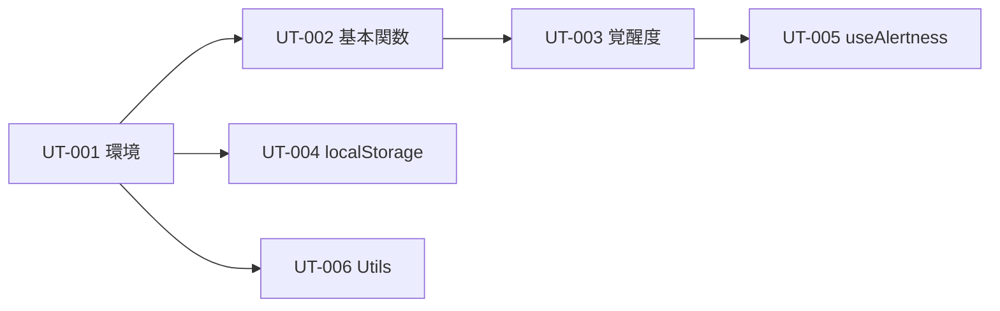

# UT バックログ インデックス

## 概要
flow-stateプロジェクトのユニットテスト実装チケット一覧。

## チケット一覧

| ID | タイトル | 見積もり | 依存 | ステータス |
|----|---------|---------|------|-----------|
| [UT-001](./001_vitest_setup.md) | Vitest テスト環境セットアップ | 30分 | - | ⏳ 未着手 |
| [UT-002](./002_caffeine_core_ut.md) | caffeine.ts 基本関数 UT | 1.5時間 | UT-001 | ⏳ 未着手 |
| [UT-003](./003_caffeine_alertness_ut.md) | caffeine.ts 覚醒度データ生成 UT | 1.5時間 | UT-001,002 | ⏳ 未着手 |
| [UT-004](./004_use_local_storage_ut.md) | useLocalStorage フック UT | 1時間 | UT-001 | ⏳ 未着手 |
| [UT-005](./005_use_alertness_ut.md) | useAlertness フック UT | 1.5時間 | UT-001,002,003 | ⏳ 未着手 |
| [UT-006](./006_utility_functions_ut.md) | ユーティリティ関数 UT | 30分 | UT-001 | ⏳ 未着手 |

## 合計見積もり
約6.5時間

## 推奨実行順序

## カバレッジ目標

| レイヤー | ファイル | 目標 |
|---------|----------|------|
| lib | `caffeine.ts` | 90% |
| hooks | `useLocalStorage.ts` | 80% |
| hooks | `useAlertness.ts` | 70% |
